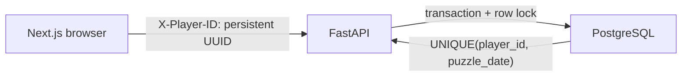

# Streak architecture

## Request flow

The browser generates its anonymous UUID with `crypto.randomUUID()` only when it can save it to `localStorage`. A storage failure is surfaced to the player, preventing disposable IDs that would lose game history or produce redundant player rows.

All game dates and the countdown target are UTC. `get_game_date()` uses `GAME_TIMEZONE`, whose deployment value must be `UTC`; the frontend computes its next boundary with `Date.UTC`, never the device's local midnight.

## Data model

`players` contains `player_id`, streak counters, `last_played_date`, and `created_at`. `attempts` contains `id`, `player_id`, `puzzle_id`, `puzzle_date`, `correct`, and `created_at`. There are no usernames and no stored guesses.

`UNIQUE(player_id, puzzle_date)` is the only index needed by the daily-attempt lookup: its leftmost prefix supports player lookups and the complete key supports the duplicate check. Standalone player/date indexes were removed as redundant.

## Transactions and concurrency

Player registration first reads by UUID and attempts an insert. If a concurrent insert wins, SQLAlchemy rolls back the failed transaction before reading the newly created row and returning it as an existing player. This is required for PostgreSQL because an `IntegrityError` leaves the transaction unusable until rollback.

Guess submission locks the player record with `FOR UPDATE` on PostgreSQL, checks for an existing attempt, updates streak state, creates the result-only attempt record, then commits. The unique constraint handles the remaining distributed race and becomes an HTTP 409 conflict. SQLite is used only for local tests and ignores `FOR UPDATE`; concurrency behavior must be verified with the separate live stress suite against PostgreSQL.

## Schema migrations

`app.db.migrations` maintains the `schema_migrations` table and applies the legacy cleanup migration atomically. It drops the old `username` and `guess` columns and redundant indexes when present. PostgreSQL migration execution takes an advisory transaction lock so multiple rollout instances cannot race.

Development startup runs pending migrations. Production startup only verifies the expected migration version and fails if it has not been applied. Deployments must run `python -m app.db.migrations` before starting web instances.
